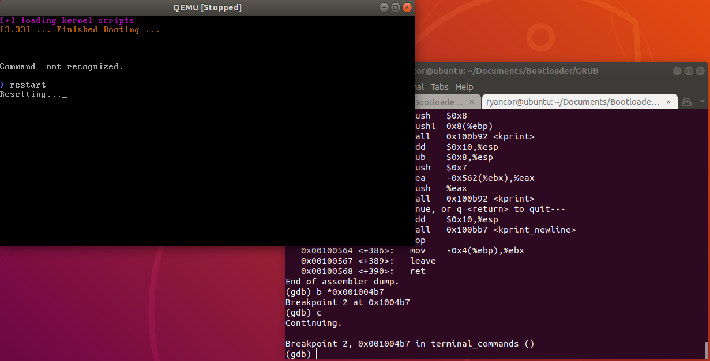

# i386-Bootloader
1. sudo apt-get install qemu

2. chmod +x install.sh && ./install.sh

## Debug OS
1. qemu-system-i386 -kernel image/kernel -s -S
	- gdb image/kernel "-ex target remote localhost:1234"

